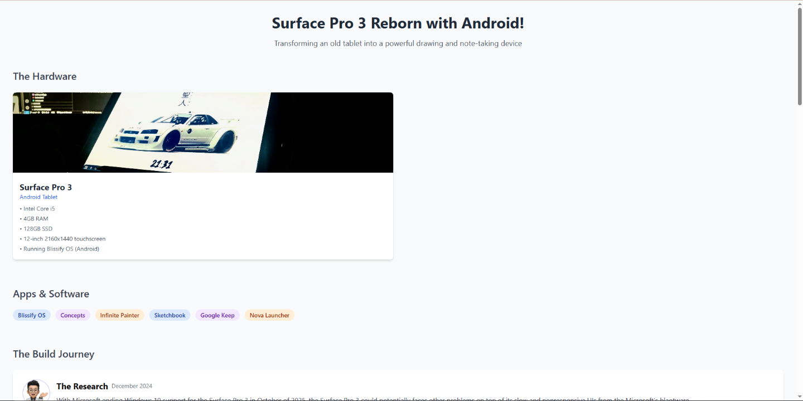
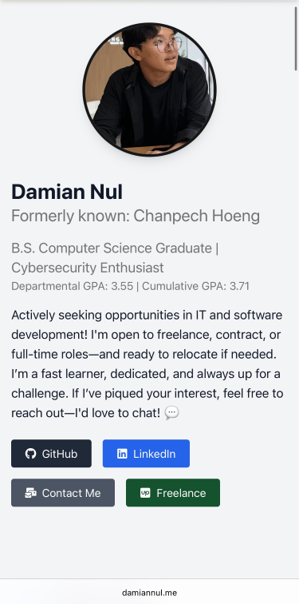

# My Professional Developer Portfolio 

Welcome to my portfolio website! This project showcases my skills, experience, blogs, and projects as a full stack (or front-end/back-end) developer. It's designed to be a responsive, modern, and fast web experience.

[Visit My Portfolio](https://damiannul.me)

## 🛠 Tech Stack 
- **Frontend:** React.js / Vite.js / Tailwind CSS / TypeScript
- **Backend:**  Node.js
- **Hosting:** Vercel / Namecheap (Domain) / GitHub Repo
- **Tools:** Figma / Git / ESLint / Prettier /
- **Libraries:** ShadCN / React-Icons / BuyMeCoffee / Framer-Motion / Emailjs-com

## Features

- Fully responsive design
- Smooth animations and transitions from Framer-Motion
- Blogs for individual project
- Contact form integration from EmailJS
- Vercel's Analytics
- Professional Domain

## Screenshots

| Desktop | Mobile |
|--------|--------|
|  |  |

## 🚀 Getting Started

To run this project locally:

```bash
git clone https://github.com/Chanpech/chanpech-entry-level-portfolio
npm install
npm run dev
```
🌐Happy Browsing🥳
